# 00_pjt-common/00_fnc-common/01_s3-access-log

## 概要

プロジェクト共通として作成しているS3バケットのアクセスログを格納するためのS3バケット

## 要件

- プロジェクト共通のバケットのS3アクセスについてロギングするためのストレージ
    - 運用者が監査用の証跡を確認できる
    - 外部から監査用の証跡は確認できない
    - データは暗号化されている

## 構成図

## 制約

- 無限ループを防ぐため、当該バケット自体に対するログ記録は無効にする。

## 参考

- [Amazon S3 サーバーアクセスログを有効にします。](https://docs.aws.amazon.com/ja_jp/AmazonS3/latest/userguide/enable-server-access-logging.html)
  AWS公式ドキュメント