# 01_audit/00_common

## 概要

AWS Configのレコーダーを作成

## 要件

- Config
    - ヒストリデータがS3に格納されている
    - ヒストリデータは暗号化されている
    - 運用者・開発者から当該ディレクトリを参照できる

## 構成図

## 方針

### S3

- audit-bucket/AWSConfigにヒストリデータを蓄える