# 00_pjt-common/01_audit/02_resource-creation-notifier

## 概要

リソースが追加されたときにSlack通知できるようにする機能

## 要件

- リソースが作られたときにSlackに通知が飛ぶ

## 構成図

## 方針

### AWS Config

既存のConfigurationRecorderを利用する

### Amazon EventBridge

- `detail-type` を `Config Configuration Item Change` に絞る
- `source` を `aws.config` に絞る
- `changeType `が `CREATE` のとき発火する
- SNSをターゲットにする

### Amazon SNS

- Chatbotのサブスクリプションを作る

### AWS Chatbot

- Slackに通知する

### Slack

- チャネル名： `${Env}-000102-resource-creation-notifier`

### 参考

- [設定項目の変更の通知例](https://docs.aws.amazon.com/ja_jp/config/latest/developerguide/example-sns-notification.html)
AWS Configが発行する通知の例